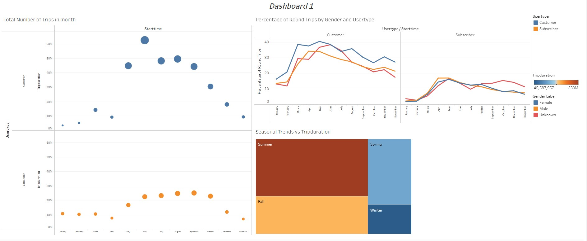
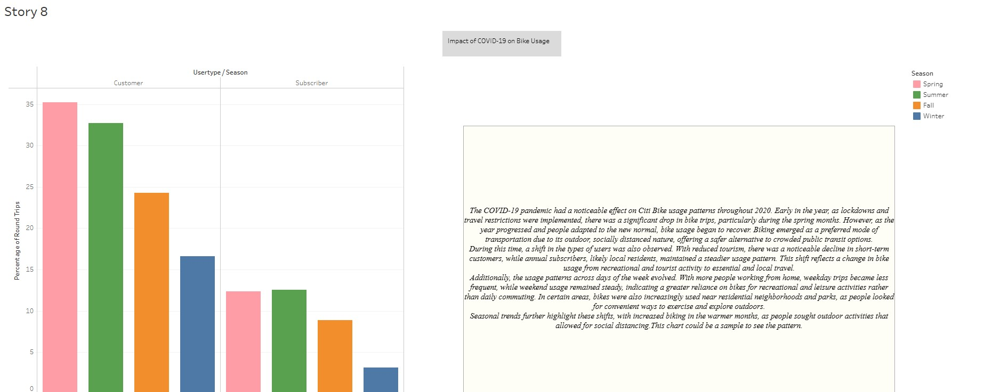

# README for Citi Bike NY Project Analysis

## Project Background

This project analyzes data from New York’s Citi Bike program, one of the largest bike-sharing initiatives in the United States. The goal of this analysis is to create insightful visualizations and dashboards in Tableau to help city officials understand key trends and usage patterns within the program. These insights are intended to guide decisions on infrastructure improvements and potential programmatic changes.

### About Citi Bike
Since its inception in 2013, the Citi Bike program has grown to serve millions of users across New York. The program collects detailed data on bike usage every month, making it available publicly for research and reporting. In this project, the focus is on aggregating, visualizing, and analyzing these data points to identify notable trends.

---

## Project Objective

The primary aim is to address critical questions city officials might have about Citi Bike’s usage, including but not limited to:
1. Monthly and seasonal ridership trends.
2. User patterns and demographics.
3. Popular starting and ending stations.
4. Bike usage duration and repair requirements.
5. Geographic trends in usage.

This project uses Tableau Public to create interactive and static visualizations, along with dashboards and a story presentation, to narrate the Citi Bike journey in New York effectively.

---

## Data Files and Structure

### Data Source

- **Citi Bike Trip History Logs:** This data is sourced directly from the Citi Bike public datasets. The analysis focuses on the year 2020 to capture pandemic usage patterns.(For the months that carefuws and social distancing applied)

### File Details
- **[Your .twbx file (Tableau Workbook)]**: This Tableau workbook file contains all visualizations, dashboards, and the final story. Each sheet within the workbook corresponds to a specific visualization.

- **Tableau Public Link**: The workbook is saved to Tableau Public, it can be accessed [here](https://public.tableau.com/app/profile/zahra.pazouki/viz/CitiBikeNY-ZaraPazouki/TotalNumberofTripsinmonth?publish=yes). 
---

## Analysis Structure

### Step-by-Step Instructions

1. **Data Preparation**:
   - Import data files covering 2020 months.
   - Clean data and merge them.
   - import it to Tableau

2. **Exploratory Analysis**:
   - Use individual sheets in Tableau to examine and visualize data from various perspectives, including:
     - Total ridership numbers.
     - User types (e.g., subscribers vs. casual users).
     - Top station for Star or End points.

4. **Dashboard Design**:
   - Dashboards are created, each focused on a different pattern or finding.
   

5. **Final Story Presentation**:
   - Organize the findings in a Tableau Story to present a cohesive narrative.
   

---

